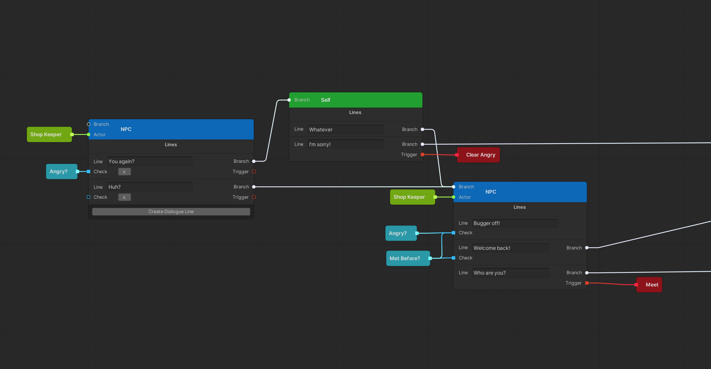
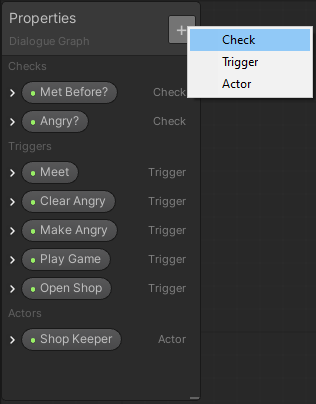
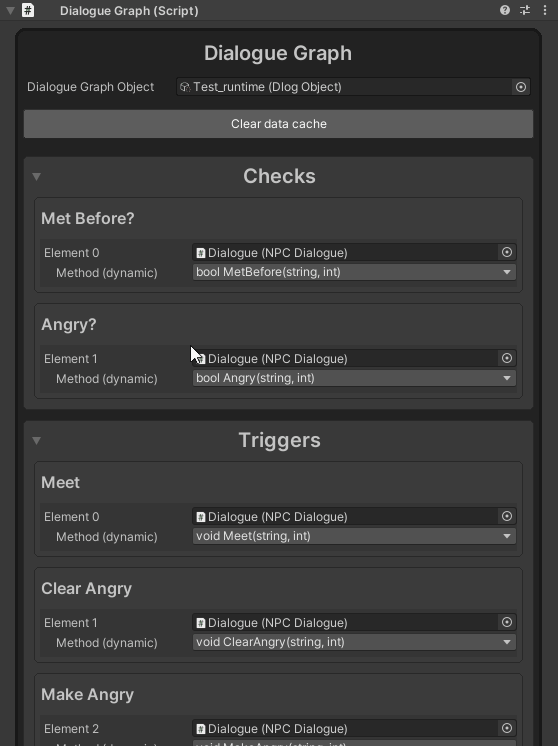
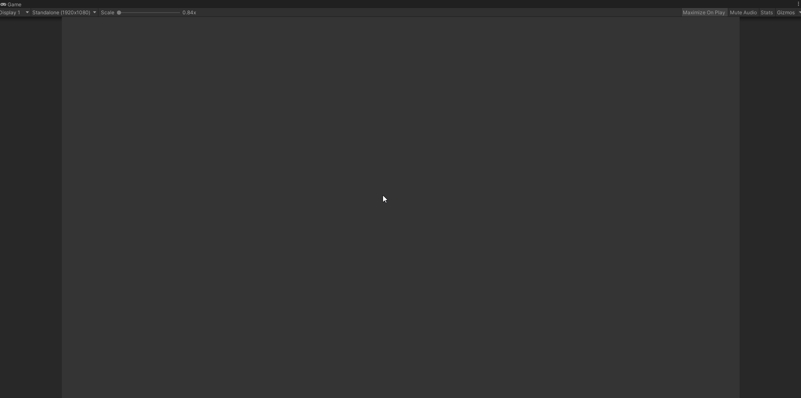

# Dialogue Graph
<p align="center">
<!--Issues--><a href="https://github.com/TeodorVecerdi/DialogueGraph/issues"></a>
<!--Code Quality--><a href="https://www.codacy.com/gh/TeodorVecerdi/DialogueGraph/dashboard?utm_source=github.com&amp;utm_medium=referral&amp;utm_content=TeodorVecerdi/DialogueGraph&amp;utm_campaign=Badge_Grade"></a>
<!--OpenUPM--><a href="https://openupm.com/packages/com.github.teodorvecerdi.dialoguegraph/"></a>
<!--Stars--><a href="https://github.com/TeodorVecerdi/DialogueGraph/stargazers"></a>
<!--Contributors--><a href="https://github.com/TeodorVecerdi/DialogueGraph/graphs/contributors"></a>
</p>

<b>DialogueGraph</b> is an open-source editor tool for the [Unity](https://unity.com/) game engine used to create branching conversation trees in an easy and straighforward way by connecting nodes, and setting up conditions and triggers for the different conversation branches. An obvious use case for this tool is to create conversations with NPCs, although the versatility of this tool allows for any kind of project that requires branching behaviour based on checks and triggers.

This project is developed for a self-defined learning objective that is part of the Personal Portfolio 1 course at Saxion.

# Installing Dialogue Graph
## 1. using OpenUPM
**Requires [ OpenUPM-CLI][openupm-cli]**  
Run the following on the command line in your unity project's folder:

```sh
openupm add com.github.teodorvecerdi.dialoguegraph
```

## 2. using Git
To install Dialogue Graph in your project use the Unity Package Manager.  
To open the Unity Package Manager, inside unity, go to `Window > Package Manager` and to install Dialogue Graph click the `+` icon in the upper left corner of the window, then click on `Add package from git URL...` and paste in `https://github.com/TeodorVecerdi/DialogueGraph.git`


# Using Dialogue Graph (WIP)
## Editor
To start using Dialogue Graph create a Dlog Graph object in your assets folder by going to `Assets > Create > Dialogue > Dlog Graph`.  
Dialogue Graph currently contains three different nodes: **NPC**, **Self**, and **Property**.
### NPC and Self Nodes
#### General
#### Dialogue Lines
The NPC and Self nodes represent the dialogue lines said by either an NPC or the player. After creating one of these two nodes you can add dialogue lines by clicking the `Create Dialogue Line` button on each respective node.  
Each dialogue line entry comes with additional ports. **Branch** and **Trigger** ports are available to both node types and the **Check** port is available only to NPC nodes.  
The **Branch** port connects to the next node in the conversation tree. This connection is used by the runtime engine to progress the conversation once an option (dialogue line) was chosen. Unless you want the conversation to end with that line you should connect the Branch port to another node.  
The **Trigger** port connects to one or more Trigger property nodes and is optional (more on that in the [**Property Nodes** section](#property-nodes)).  
The **Check** port connects to one or more Check property or Combiner nodes and is optional (more on that in the [**Property Nodes** section](#property-nodes)).
#### Actor Port
NPC nodes also contain an **Actor** port to which you should connect your Actor Property node (more on that in the [**Property Nodes** section](#property-nodes)). Actor property nodes not only let you differentiate between which character performs the dialogue lines but also allows you to attach any custom data to the actor through scriptable objects.
### Property Nodes
### Images
Note: The following images use the Sample Project included with the package. You can install the Sample Project by going to the package manager, selecting Dialogue Graph, and clicking the `Import` button under Samples.  
Nodes:  
  

Properties: (you can open the properties window by clicking the "Blackboard" button in the toolbar at the top of the Dialogue Graph window)  
  

## Runtime
### Images
Note: The following images use the Sample Project included with the package. You can install the Sample Project by going to the package manager, selecting Dialogue Graph, and clicking the `Import` button under Samples.  
#### Attaching functions to properties
Attaching functions to properties is almost identical to the way you would do it with the Unity UI system (Buttons, TextFields, etc). Attach a script to the object field and then choose the method you want to use.  

  
#### Dialogue Graph in action
Check the included samples for the API usage.  

  

# Contributing
If you would like to contribute to this project feel free to submit a **pull request**, and take a look at the 
[Contributing document](https://github.com/TeodorVecerdi/DialogueGraph/blob/master/Github~/CONTRIBUTING.md "CONTRIBUTING.md") provided to get a better insight into what **contributing** means, and the [Code of Conduct](https://github.com/TeodorVecerdi/DialogueGraph/blob/master/Github~/CODE_OF_CONDUCT.md).

# Versioning
We use [SemVer](http://semver.org/) for versioning. For the versions available check the [tags on this repository](https://github.com/TeodorVecerdi/DialogueGraph/tags).

# License
This project is licensed under the MIT License. See [LICENSE](https://github.com/TeodorVecerdi/DialogueGraph/blob/master/LICENSE) for more details.

[openupm-cli]: https://openupm.com/docs/getting-started.html#installing-openupm-cli
